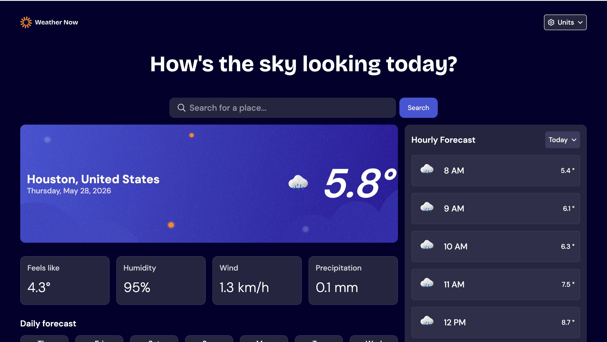
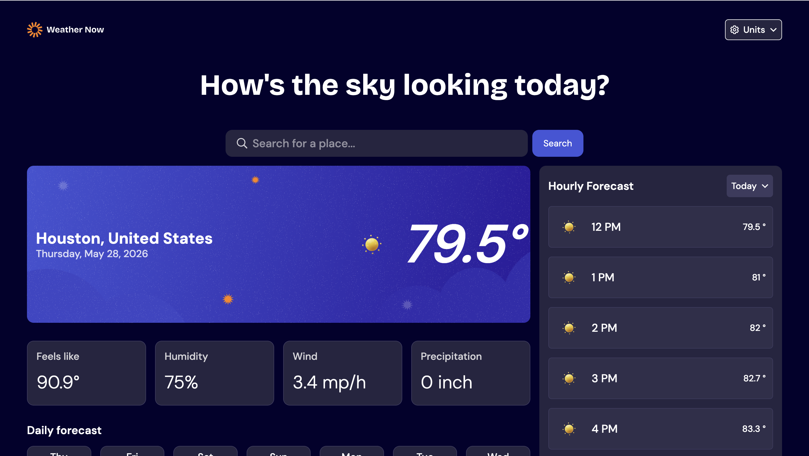
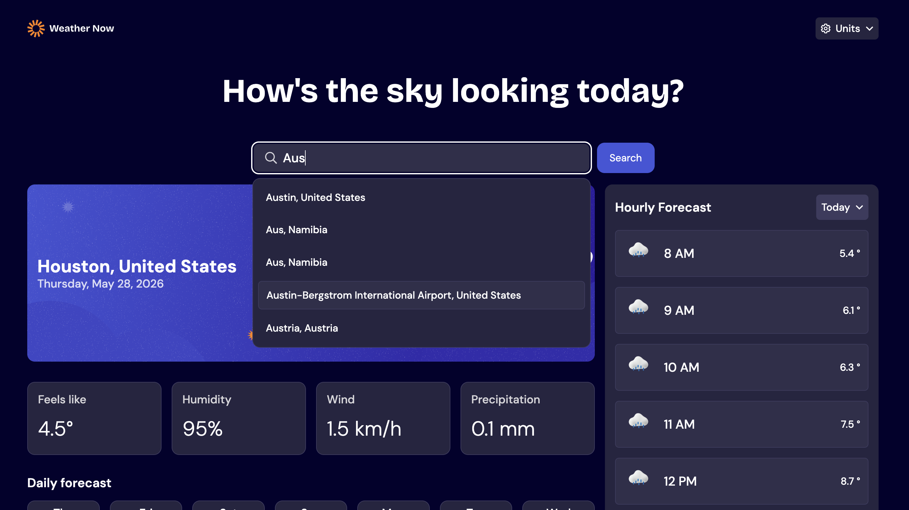
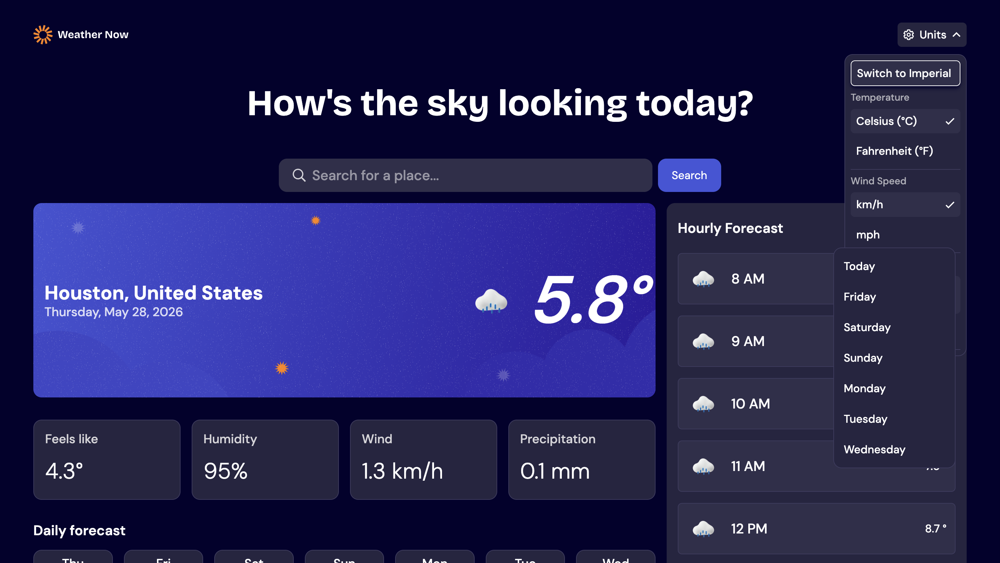
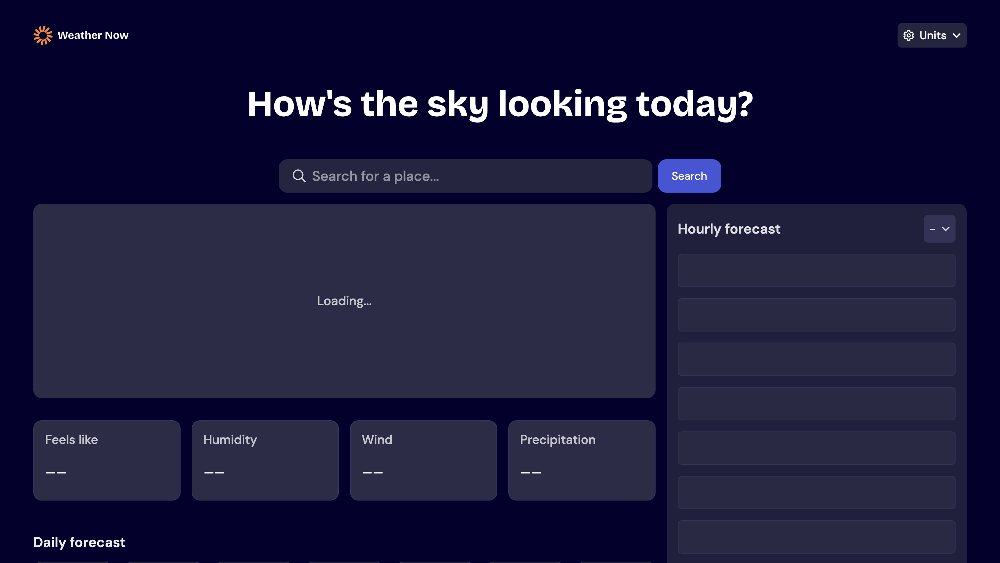
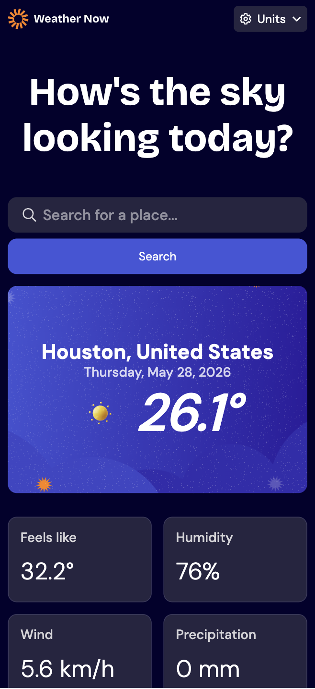
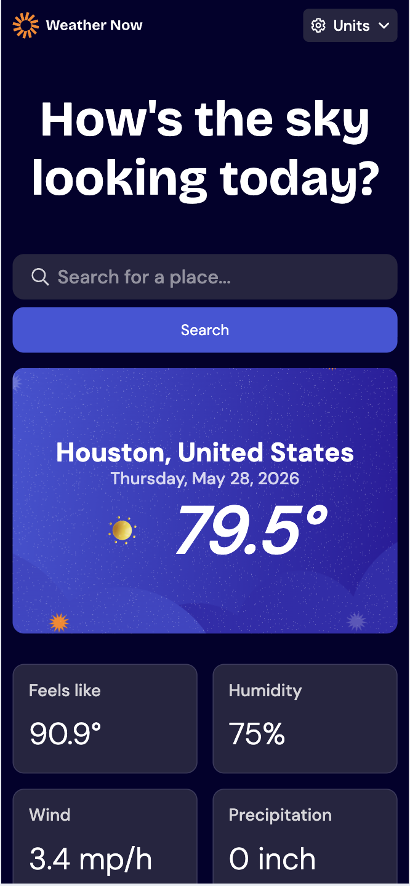
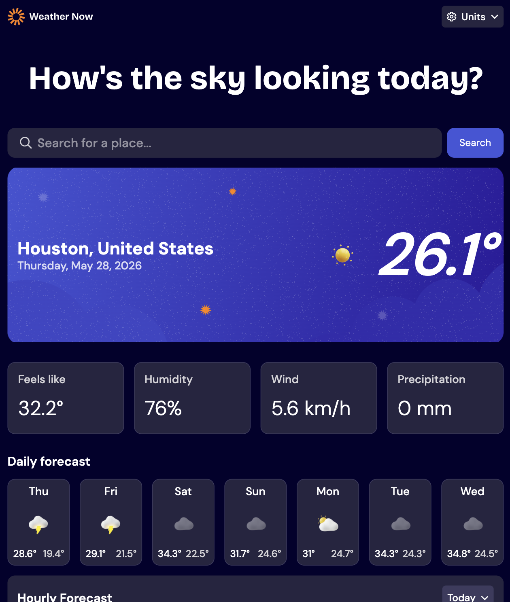
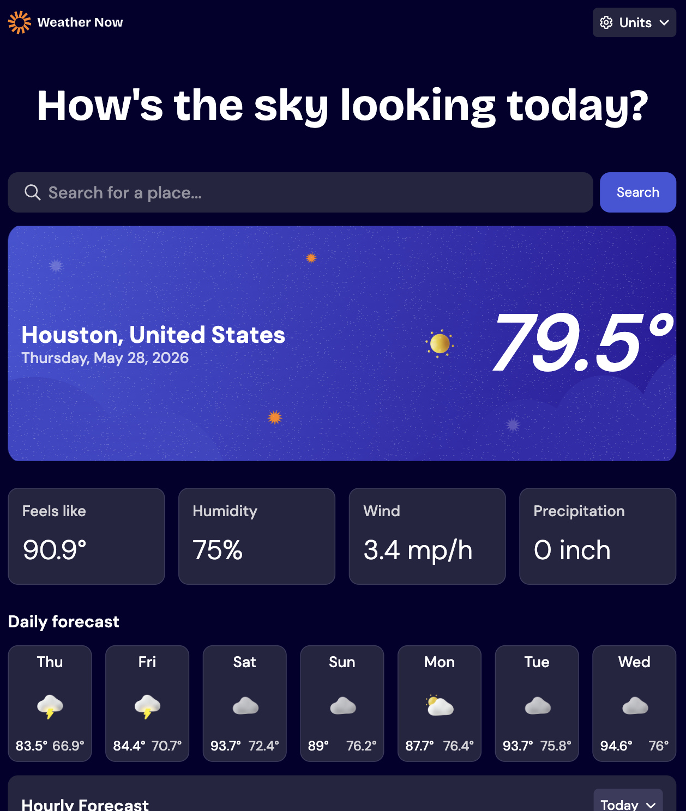

# Frontend Mentor - Weather app solution

This is a solution to the [Weather app challenge on Frontend Mentor](https://www.frontendmentor.io/challenges/weather-app-K1FhddVm49). Frontend Mentor challenges help you improve your coding skills by building realistic projects. 

## Table of contents

- [Overview](#overview)
  - [The challenge](#the-challenge)
  - [Screenshot](#screenshot)
  - [Links](#links)
  - [Built with](#built-with)
  - [What I learned](#what-i-learned)
  - [Continued development](#continued-development)
  - [AI Collaboration](#ai-collaboration)
- [Author](#author)

## Overview

Weather application developed with React and Vite built as a Frontend Mentor challenge. It consumes the Open-Meteo API (free, no API key) to display real-time weather data.

### The challenge

Users should be able to:

- Search for weather information by entering a location in the search bar
- View current weather conditions including temperature, weather icon, and location details
- See additional weather metrics like "feels like" temperature, humidity percentage, wind speed, and precipitation amounts
- Browse a 7-day weather forecast with daily high/low temperatures and weather icons
- View an hourly forecast showing temperature changes throughout the day
- Switch between different days of the week using the day selector in the hourly forecast section
- Toggle between Imperial and Metric measurement units via the units dropdown 
- Switch between specific temperature units (Celsius and Fahrenheit) and measurement units for wind speed (km/h and mph) and precipitation (millimeters) via the units dropdown
- View the optimal layout for the interface depending on their device's screen size
- See hover and focus states for all interactive elements on the page

### Screenshot

### Links

- Solution URL: [Frontend Mentor](https://www.frontendmentor.io/solutions/responsive-weather-app-using-vite-react-tailwind-css-JLrpbj13c3)
- Live Site URL: [Weather App](https://weather-app-zeta-three-98.vercel.app/)

## My process

### Built with

- Mobile-first workflow
- [React](https://react.dev/) - JS library
- [Vite](https://vite.dev/) 
- [Tailwind CSS](https://tailwindcss.com/) 
- [Open-Meteo API ]( https://open-meteo.com/) 
- [Open-Meteo Geocoding API ]( https://open-meteo.com/en/docs/geocoding-api/) 

### What I learned

1. useReducer for Complex State: How to replace multiple `useState` hooks with `useReducer` to manage application states (idle, loading, success, error, locating) in a more predictable manner and without cascading renders.

2. Canceling Requests with AbortController: How to cancel in-flight fetch requests when the user changes the city or units—before the previous response arrives—thereby avoiding race conditions.

3. Debouncing City Search: How to implement manual debouncing using `setTimeout`/`clearTimeout` to avoid making an API call on every user keystroke.

4. Error Boundary as a First Line of Defense: How to use an ErrorBoundary to catch rendering errors in child components without crashing the entire app, displaying a user-friendly error state instead.

### Continued development

1. More Granular Custom Hooks:  the project already features `useCitySuggestions`, but the reducer logic and API calls remain within the Provider. Extracting a `useWeather` hook would help better separate responsibilities.

2. TypeScript — the project is currently in JSX. Migrating to TSX—with explicit types for API responses and reducer state—would be a natural next step.

3. Testing — there are currently no tests in the project. Practice writing unit tests using Vitest/Testing Library for the hooks and presentational components.

4. Performance — explore `React.memo`, `useMemo`, and `useCallback` to prevent unnecessary re-renders. 

### AI Collaboration

Tools Used: Claude (Anthropic) via Claude Code

How It Was Used:

The AI ​​acted as an experienced colleague, not merely as a code generator. Instead of asking for direct solutions, I used it to:

Discuss approaches and trade-offs prior to implementation—for example, choosing between multiple `useState` hooks versus `useReducer` for app state, or how to structure error handling.
Guided debugging—when something wasn't working (such as cascading re-renders or forecast dates being calculated based on the browser's timezone rather than the city's), the AI ​​would pinpoint the problem area and ask me questions to help me identify the root cause.
Code review for every feature—checking whether a pattern was maintainable, if there were unhandled edge cases, or if accessibility was implemented correctly.
Architecture—deciding when to extract a custom hook (`useCitySuggestions`), when to use Context, and how to organize services.

## Author

- Website - [Laura Elena Mesa](https://portfolio-app-three-red.vercel.app/)
- Frontend Mentor - [@laurymesa01](https://www.frontendmentor.io/profile/laurymesa01)
- LinkedIn - [@lauraelenamesa](https://www.linkedin.com/in/lauraelenamesa/)

